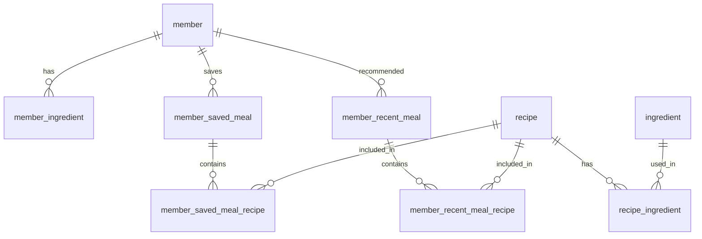
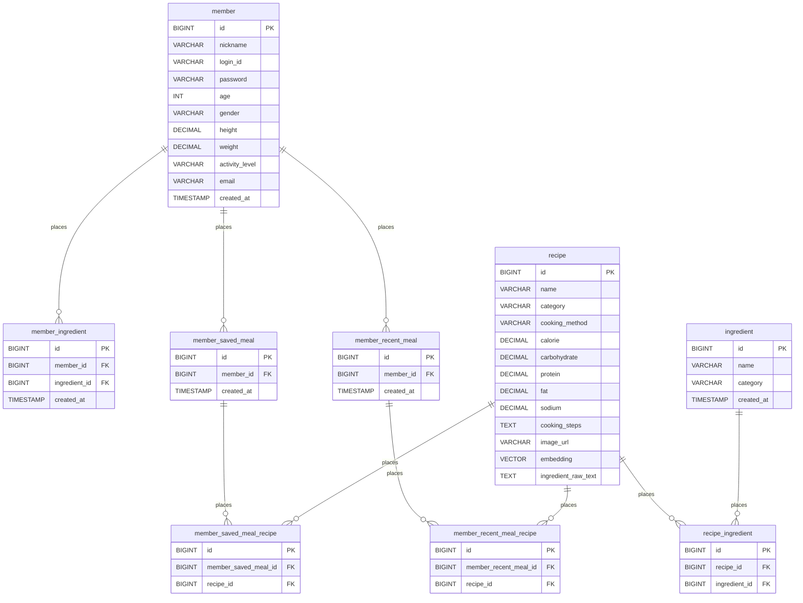

# mealgram erd

### 목차

- [mealgram erd](#mealgram-erd)
    - [목차](#목차)
    - [ERD 테이블 구조](#erd-테이블-구조)
    - [ERD 전체 구조](#erd-전체-구조)
    - [ERD 상세 구조](#erd-상세-구조)
  - [회원](#회원)
    - [member (회원)](#member-회원)
    - [member\_ingredient (회원 재료)](#member_ingredient-회원-재료)
    - [member\_saved\_meal (회원 저장식단)](#member_saved_meal-회원-저장식단)
    - [member\_saved\_meal\_recipe (회원 저장식단 레시피)](#member_saved_meal_recipe-회원-저장식단-레시피)
    - [member\_recent\_meal (회원 최근 추천식단)](#member_recent_meal-회원-최근-추천식단)
    - [member\_recent\_meal\_recipe (회원 최근 추천식단 레시피)](#member_recent_meal_recipe-회원-최근-추천식단-레시피)
  - [레시피](#레시피)
    - [recipe (레시피)](#recipe-레시피)
    - [ingredient (재료)](#ingredient-재료)
    - [recipe\_ingredient (레시피 재료)](#recipe_ingredient-레시피-재료)

---

### ERD 테이블 구조

---

### ERD 전체 구조

---

### ERD 상세 구조 

## 회원

### member (회원)

| 컬럼 | 타입 | 제약 |
| --- | --- | --- |
| id | BIGINT | PK |
| nickname (닉네임) | VARCHAR(10) | NOT NULL, 2~10자, 특수문자 허용, 중복허용 |
| login_id (아이디) | VARCHAR(20) | NOT NULL, UNIQUE, 영문 소문자+숫자 6~20자 |
| password (비밀번호) | VARCHAR(255) | NOT NULL, 해시 저장(BCrypt), 원문 규칙: 8~20자 영문+숫자+특수문자 중 2종류 이상 |
| age (나이) | INT | nullable, 마이페이지에서 입력/수정 가능 |
| gender (성별) | VARCHAR | nullable |
| height (키) | DECIMAL | nullable |
| weight (몸무게) | DECIMAL | nullable |
| activity_level (활동량) | VARCHAR | nullable |
| email (이메일) | VARCHAR | NOT NULL, UNIQUE |
| created_at (가입일시) | TIMESTAMP | NOT NULL |

### member_ingredient (회원 재료)

| 컬럼 | 타입 | 제약 |
| --- | --- | --- |
| id | BIGINT | PK |
| member_id (회원id) | BIGINT | FK → member.id |
| ingredient_id (재료id) | BIGINT | FK → ingredient.id |
| created_at (등록일시) | TIMESTAMP | NOT NULL |

### member_saved_meal (회원 저장식단)

| 컬럼 | 타입 | 제약 |
| --- | --- | --- |
| id | BIGINT | PK |
| member_id (회원id) | BIGINT | FK → member.id |
| created_at (저장일시) | TIMESTAMP | NOT NULL |

### member_saved_meal_recipe (회원 저장식단 레시피)

| 컬럼 | 타입 | 제약 |
| --- | --- | --- |
| id | BIGINT | PK |
| member_saved_meal_id (회원 저장 식단id) | BIGINT | FK → member_saved_meal.id |
| recipe_id (레시피id) | BIGINT | FK → recipe.id |

### member_recent_meal (회원 최근 추천식단)

| 컬럼 | 타입 | 제약 |
| --- | --- | --- |
| id | BIGINT | PK |
| member_id (회원id) | BIGINT | FK → member.id |
| created_at (추천일시) | TIMESTAMP | NOT NULL |

### member_recent_meal_recipe (회원 최근 추천식단 레시피)

| 컬럼 | 타입 | 제약 |
| --- | --- | --- |
| id | BIGINT | PK |
| member_recent_meal_id (회원최근추천식단id) | BIGINT | FK → member_recent_meal.id |
| recipe_id (레시피id) | BIGINT | FK → recipe.id |

---

## 레시피

### recipe (레시피)

| 컬럼 | 타입 | 제약 |
| --- | --- | --- |
| id | BIGINT | PK |
| name (레시피명) | VARCHAR(50) | NOT NULL, 중복허용 |
| category (카테고리) | VARCHAR | NOT NULL |
| cooking_method (조리방법) | VARCHAR | NOT NULL |
| calorie (칼로리) | DECIMAL | NOT NULL |
| carbohydrate (탄수화물) | DECIMAL | NOT NULL |
| protein (단백질) | DECIMAL | NOT NULL |
| fat (지방) | DECIMAL | NOT NULL |
| sodium (나트륨) | DECIMAL | NOT NULL |
| cooking_steps (조리단계) | TEXT | NOT NULL |
| image_url (이미지url) | VARCHAR | nullable |
| embedding (임베딩 벡터) | VECTOR(1536) | NOT NULL |
| ingredient_raw_text (원본 재료 텍스트) | TEXT | NOT NULL |

### ingredient (재료)

| 컬럼 | 타입 | 제약 |
| --- | --- | --- |
| id | BIGINT | PK |
| name (재료명) | VARCHAR(50) | NOT NULL, UNIQUE |
| category (카테고리) | VARCHAR | NOT NULL |
| created_at (등록일시) | TIMESTAMP | NOT NULL |

### recipe_ingredient (레시피 재료)

| 컬럼 | 타입 | 제약 |
| --- | --- | --- |
| id | BIGINT | PK |
| recipe_id (레시피id) | BIGINT | FK → recipe.id |
| ingredient_id (재료id) | BIGINT | FK → ingredient.id, UNIQUE(recipe_id, ingredient_id) |

